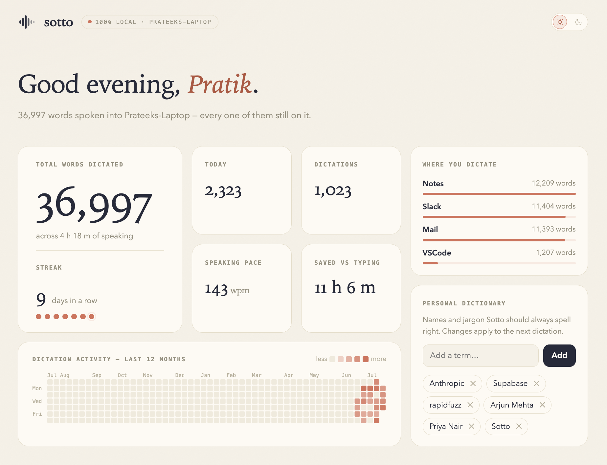
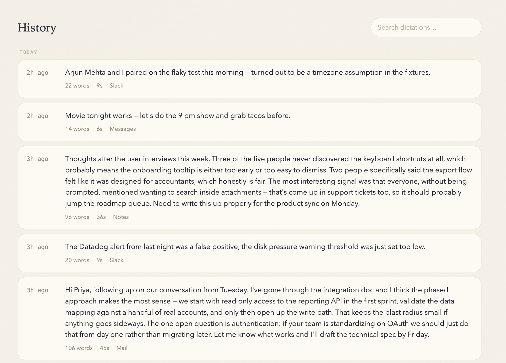

# Sotto

**Your voice, your machine, your data. Private dictation for macOS, Linux, and Windows.**

[](https://github.com/psancheti6666/sotto/actions/workflows/tests.yml)
[](https://github.com/psancheti6666/sotto/releases/latest)
[](#platform-support)
[](LICENSE)

Hold a key, speak naturally, release — clean, punctuated text appears at your
cursor in whatever app you're using. The speech recognition **and** the AI
cleanup run entirely on your machine. No account, no subscription, no cloud,
**$0 to run**.



**[Download](#download) · [Install](#install) · [Using Sotto](#using-sotto) ·
[Privacy & permissions](#privacy-permissions--the-network) ·
[Contributing](#contributing)**

## Why Sotto?

Dictation is the fastest way to write — and the most intimate data you can
hand to software. A cloud dictation tool doesn't just hear the occasional
memo: it hears your private messages, your emails, your half-formed thoughts,
and everything you tell AI assistants, because that's exactly where you
dictate. All of it, by design, leaves your computer for someone else's server
under a privacy policy that can change.

Sotto is the same hold-to-talk workflow as tools like Wispr Flow, built on a
different premise: **none of it is anyone else's business.**

- **Everything runs locally** — a state-of-the-art speech model and a small
  LLM for cleanup, on your own hardware. Wi-Fi off, Sotto still works.
- **Your data is yours.** Audio is never stored; your dictation history lives
  in one readable file on your disk, and there is no server it could even be
  uploaded to.
- **Open source (MIT).** Nobody owns your dictation stack — the code is all
  here, so "local-only" is a property you can audit, not a marketing claim.
- **Free, forever.** No tiers, no seats. Your recurring cost is a few seconds
  of electricity per dictation.

## What it does

- **Hold, speak, release** → your words land at the cursor in any app —
  notes, chat, email, code editor. Hotkey: `fn` on macOS, `Right Ctrl` on
  Linux and Windows (configurable).
- **Cleans, never rewrites** — fillers ("um", "you know") removed,
  punctuation and capitalization added, self-corrections resolved: say
  *"let's meet Tuesday — wait, no, Friday"* and it types *"Let's meet
  Friday."* Your wording is preserved.
- **Hands-free mode** — up to 15 minutes of continuous dictation, with an
  on-screen waveform capsule and a countdown near the limit.
- **Personal dictionary** — your names and jargon, spelled right even when
  the recognizer mishears them.
- **Insights** — a local dashboard with your history (click to copy), search,
  stats, streaks, and dictionary editing.
- **App-aware tone** — formatting adapts to the focused app (chat vs. email
  vs. code).

## Download

**[⬇ Latest release](https://github.com/psancheti6666/sotto/releases/latest)** — one version, every platform:

| Platform | File | Works on |
|---|---|---|
| macOS (Apple Silicon) | `Sotto-…-apple-silicon.dmg` | macOS 14+, M1 or newer |
| macOS (Intel) | `Sotto-…-intel.dmg` | macOS 14+ |
| Linux (deb) | `Sotto-…-amd64.deb` | Ubuntu 22.04+ / Debian 12+, X11 & Wayland |
| Linux (AppImage) | `Sotto-…-x86_64.AppImage` | Other distros (Fedora 36+ …), amd64 |
| Windows | `Sotto-…-windows-amd64.zip` | Windows 10/11, 64-bit |

All platforms need **~10 GB free disk** during setup (~5 GB kept for the AI
models) and **~6 GB free memory while dictating** (an idle Sotto holds
~1.5 GB). Internet is needed once, for the model download — never after.

## Install

### macOS

1. Open the DMG for your chip ( → About This Mac shows which), drag
   **Sotto** into **Applications**, launch it.
2. macOS will say it can't verify the app (Sotto isn't notarized — that's a
   $99/yr program and this is a free app): **System Settings → Privacy &
   Security → Open Anyway**. One time only.
3. Sotto walks you through the rest itself — microphone, Accessibility, and
   Input Monitoring permissions, then the one-time model download. If Sotto
   isn't listed in a permission pane, add it with the **+** button.

### Linux

1. **Ubuntu/Debian:** double-click the `.deb` and install (one password
   prompt — that same prompt grants Sotto its keyboard access, so dictation
   works from the first launch, no re-login).
   **Other distros:** make the `.AppImage` executable (right-click →
   Properties → *Executable as Program*) and run it; its setup screen's
   **Fix** button asks for your password once to install the same permission
   files.
2. Launch **Sotto** from your app grid. The setup screen handles the rest —
   the one-time model download, and on GNOME Wayland one extra step it walks
   you through (`ydotool`, the typing helper there).

### Windows

1. **Extract the zip first** (right-click → **Extract All…**) — Windows opens
   zips like folders, but the app can't run from inside one (you'd see
   "Failed to load Python DLL").
2. In the extracted folder, run `sotto\sotto.exe`. Windows shows **"Windows
   protected your PC"** — expected for now, the draft build isn't
   code-signed (a Microsoft Store release, which removes this, is the plan):
   click **More info → Run anyway**.
3. The setup screen checks your microphone setting, asks once before the
   model download, then Sotto restarts itself ready to dictate. Autostart is
   offered, never silently enabled.

## Using Sotto

Hold the hotkey, speak, release — that's most of it. The full gesture set:

| Gesture | macOS (`fn`) | Windows (`Right Ctrl`) | Linux (`Right Ctrl`) |
|---|---|---|---|
| Hold · speak · release | ✅ | ✅ | ✅ |
| Double-tap → hands-free | ✅ | ✅ | ✅ |
| Hold + tap Space → hands-free | ✅ Space swallowed | ✅ Space swallowed | — use double-tap |
| Hotkey again in hands-free | ✅ finish & insert | ✅ | ✅ |
| Escape while dictating | ✅ cancel, swallowed | ✅ cancel, swallowed | ✅ cancel (Escape also reaches the app) |
| Hotkey inside a shortcut (`fn`+Delete, `Ctrl`+C…) | silently cancels; the shortcut works | same | same |

While you dictate, a small capsule at the bottom of the screen shows a live
waveform; in hands-free it adds clickable **✕** (cancel) and **✓** (finish)
buttons, and it spins while transcribing. Cancelling shows an **Undo** toast
for ~3 seconds — click it and the recording is transcribed after all. Long
sessions get an amber countdown for the last minute, then finish and are
transcribed **in full** — never truncated. Soft system sounds mark start and
finish.

**Mind on Linux:** macOS blocks dictation in password fields (secure input);
Linux has no such mechanism, so Sotto will type wherever your cursor is.

## Insights

Sotto keeps a local history and shows it in a native **Insights** window
(menu-bar icon on macOS, tray icon on Linux/Windows) — every dictation
newest-first (click to copy), live search, words-per-minute and time-saved
stats, a year-long activity heatmap, dictionary editing, light/dark theme,
and Ctrl/Cmd `+`/`−` zoom.



The page is served by the Sotto process itself at `127.0.0.1:8377`, binds
only to localhost, and loads nothing from the internet. History is one
human-readable file — `~/.sotto/history.jsonl` — delete it to wipe your
history. *(Screenshots show demo data; a real install starts empty.)*

## Privacy, permissions & the network

**What Sotto can access, and why — the honest version:**

- **Microphone (all platforms)** — obviously. Nothing is recorded until you
  hold the hotkey.
- **macOS: Accessibility + Input Monitoring** — to type at your cursor and
  to see its hotkey globally. Standard for any dictation or hotkey app;
  macOS asks you explicitly for both.
- **Linux: keyboard-device access** — the install's one password prompt adds
  a udev `uaccess` rule so your desktop session can read input devices
  (works on X11 *and* Wayland). Honest trade-off: any program running as you
  could then technically read keystrokes too — the same exposure class as
  the common `usermod -aG input` setup, made visible instead of buried.
  Everything that ever runs with root privileges is plain readable shell in
  [`linuxapp/`](linuxapp/). If that trade-off isn't right for you, don't
  install — or audit first.
- **Windows: no permission wall** — a keyboard hook and synthetic typing are
  ordinary user-level APIs there. Limit in the other direction: Sotto can't
  type into windows running *as administrator* (a Windows security boundary,
  not a bug).

**Network calls — the complete list, all platforms:**

1. **First-run downloads, with your explicit OK**: the speech and cleanup
   models (and the [Ollama](https://ollama.com) engine if you don't already
   have it).
2. **A release check against GitHub** (one API call): scheduled once a day on
   macOS/Linux (`update_check_days = 0` turns it off) — on Windows only when
   you click **Check for Updates…**.
3. **The update download itself, when you say yes.** macOS and Linux update
   in place (Linux verifies the download's signature against a pinned key
   before anything installs — the published `.sig` files); Windows currently
   opens the download page for you instead.
4. **One anonymous usage count a day.** So the maintainers can tell whether
   Sotto is used and useful, it sends a daily rollup of *only*
   `{a random install id, the date, your OS + CPU type, the version, how many
   dictations, how many words}`. **Your voice, your transcripts, the apps you
   type into, and your IP are never sent** — nothing you say or type leaves the
   machine. The aggregate is public at the project's `/stats.json` for anyone
   to inspect. Turn it off with `telemetry = false` in `~/.sotto/config.toml`
   or `SOTTO_NO_TELEMETRY=1`.

That's the whole list — no accounts, no ad/analytics SDKs, no content ever
leaves your machine, and the dashboard page makes zero external requests. Audio
never touches disk; transcripts exist only in your local history file.

## Configuration

Optional — create `~/.sotto/config.toml`:

<details>
<summary>All settings with defaults</summary>

```toml
hotkey = "fn"              # macOS: "fn", "alt_r", "cmd_r", "f13", …
                           # Linux/Windows: "ctrl_r" (default), "alt_r", "f9", …
max_utterance_s = 900.0    # dictation limit (seconds)
ollama_model = "qwen3:4b-instruct"  # "llama3.2:3b" is faster on CPU / 8 GB machines
asr_backend = "auto"       # "mlx" (Apple Silicon) | "onnx" (everything else)
onnx_quantization = ""     # set "int8" for slow CPUs (smaller + faster, tiny accuracy cost)
indicator = true           # on-screen capsule
dashboard = true           # local history dashboard at 127.0.0.1:8377
dashboard_port = 8377
open_dashboard_on_start = true
sounds = true              # start/finish sounds
haptics = true             # trackpad tap on start (macOS only)
update_check_days = 1      # scheduled release check; 0 = off
indicator_offset_y = 6.0   # capsule distance from screen bottom (px)
keystroke_apps = []        # apps where paste doesn't work (bundle ids on macOS,
                           # WM_CLASS on Linux, exe names on Windows; terminals
                           # are covered by default)

[tone_map]                 # app id -> tone hint
"com.example.chat" = "casual chat message"
"signal" = "casual chat message"
```

</details>

Personal dictionary — `~/.sotto/dictionary.txt`, one term per line (or edit
it in Insights):

```
Anthropic
Kubernetes
Saanvi Reddy
```

## How it works

```
hold hotkey ──► mic capture (16 kHz) ──► Parakeet ASR (MLX or ONNX, ~0.3–1 s)
            ──► personal-dictionary fix ──► LLM cleanup (Ollama, ~1 s on GPU)
            ──► typed at your cursor (clipboard-paste fallback for long text)
```

Speech recognition is NVIDIA's **Parakeet-TDT-0.6B-v3** — on Apple Silicon
it runs on the Neural Engine via [MLX](https://github.com/ml-explore/mlx),
everywhere else the same model runs via ONNX on the CPU. Cleanup is
**Qwen3-4B-Instruct** under a strict fidelity prompt, served by a local
Ollama that is never exposed to the network. End-to-end latency is **1–2 s**
on Apple Silicon; on CPU-only machines the cleanup model is the bottleneck
(several seconds — switch `ollama_model = "llama3.2:3b"` if that's too
slow). If the cleanup model is ever unavailable, Sotto falls back to a basic
regex cleanup rather than blocking.

## Platform support

| Platform | Status |
|---|---|
| macOS, Apple Silicon (M1+) | ✅ Developed and tested on real hardware |
| macOS, Intel | 🤝 Community-tested (same code, ONNX speech engine) |
| Linux, X11 & Wayland | 🤝 Community-tested — validated on real Ubuntu desktops |
| Windows 10/11 | 🤝 Community-tested — the app was validated end-to-end on real Windows 11 (2026-07); the packaged-install (Store) round is still ahead |

"Community-tested" means: the code paths are unit-tested and CI-built, but
the maintainer's hardware is an Apple-Silicon Mac. If you run Sotto on one of
these platforms, please open an issue saying how it went — working or not.
Attach `~/.sotto/sotto.log` when reporting problems; it records what Sotto
was doing, never your dictated text.

**Known limitations:** English works best (the speech model also covers 24
other European languages; the cleanup prompt is English-tuned). Very heavy
phonetic mishearings can escape the dictionary fix. Linux can't swallow keys
(Escape also reaches the app) and remapped keyboards (keyd/kmonad) may
report the hotkey from its pre-remap position. Windows builds are unsigned
until the Store release, and can't dictate into admin windows.

## Run from source

macOS and Linux — and it's how you get changes the moment they're merged:

```sh
git clone https://github.com/psancheti6666/sotto.git
cd sotto
./setup.sh     # installs everything, narrating each step (~5 GB of models)
./run.sh       # start Sotto (auto-updates itself via git on each start)
```

On Windows there's no setup script yet — use the packaged zip above, or set
up a checkout by hand: Python 3.11, `py -3.11 -m venv .venv`,
`.venv\Scripts\pip install -r requirements.txt`, then
`.venv\Scripts\python -m sotto`.

Verify an install with `.venv/bin/python tests/test_pipeline.py --all` —
units plus live checks of the recognizer (OS-synthesized speech, no mic
needed) and the cleanup model. `SOTTO_NO_UPDATE=1 ./run.sh` skips the
auto-update.

## Contributing

Bug reports, PRs, and "it works on my machine" reports are all welcome —
real-hardware reports from Intel Macs, Linux desktops, and Windows are
especially valuable. Start with **[CONTRIBUTING.md](CONTRIBUTING.md)** (setup,
code map, tests, and the ground rules — the short version: everything stays
100% local, and cleanup stays faithful to what you said). We follow the
[Contributor Covenant](CODE_OF_CONDUCT.md).

## License

[MIT](LICENSE) — free, forever. *Sotto* is from *sotto voce* — "under the
breath": speak quietly, keep it to yourself.
